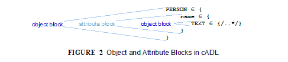
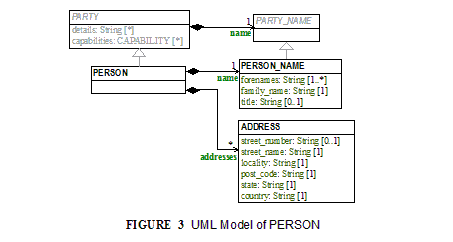
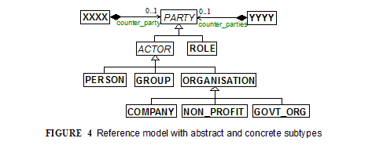

cADL - Constraint ADL
+++++++++++++++++++++

image:CDL-1.png[image]

Overview

cADL is a block-structured syntax which enables constraints on data
defined by object-oriented information models to be expressed in
archetypes or other knowledge definition formalisms. It is most useful
for defining the specific allowable configurations of data whose
instances conform to very general object models. cADL is used both at
design time, by authors and/or tools, and at runtime, by computational
systems which validate data by comparing it to the appropriate sections
of cADL in an archetype. The general appearance of cADL is illustrated
by the following example:

------------------------------------------------------------------------------------------------------
    PERSON[id1] matches {                               -- constraint on a PERSON instance
        name matches {                                  -- constraint on PERSON.name
            TEXT[id2] matches {/.+/}                    -- any non-empty string
        }
        addresses cardinality matches {1..*} matches {  -- constraint on
            ADDRESS[id3] matches {                      -- PERSON.addresses
                -- etc --
            }
        }
    }
------------------------------------------------------------------------------------------------------

Some of the textual keywords in this example can be more efficiently
rendered using common mathematical logic symbols. In the following
example, the `matches` keyword have been replaced by an equivalent
symbol:

-------------------------------------------------------------------------------------------------
    PERSON[id1] ∈ {                            -- constraint on a PERSON instance
        name ∈ {                               -- constraint on PERSON.name
            TEXT[id2] ∈ {/..*/}                -- any non-empty string
        }
        addresses cardinality ∈ {1..*} ∈ {    -- constraint on
            ADDRESS[id3] ∈ {                   -- PERSON.addresses
                -- etc --
            }
        }
    }
-------------------------------------------------------------------------------------------------

The full set of equivalences appears below. Raw cADL is persisted in the
text-based form, to remove any difficulties when authoring cADL text in
normal text editors, and to aid reading in English. However, the
symbolic form might be more widely used for display purposes and in more
sophisticated tools, as it is more succinct and less language-dependent.
The use of symbols or text is completely a matter of taste, and no
meaning whatsoever is lost by completely ignoring one or other format
according to one’s personal preference. This document uses both
conventions.

In the standard cADL documented in this section, literal leaf values
(such as the regular expression ` /.+/` in the above example) are always
constraints on a set of ‘standard’ widely-accepted primitive types, as
described in the openEHR ODIN syntax specification.

Basics

==== Keywords

The following keywords are recognised in cADL:

* _matches, ~matches, is_in, ~is_in_
* _occurrences, existence, cardinality_
* _ordered, unordered, unique_
* _use_node, allow_archetype_
* _include, exclude_
* _before_ , _after_

Symbol equivalents for some of the above are given in the following
table.

[width="100%",cols="34%,33%,33%",options="header",]
|=========================================
|Textual +
 Rendering |Symbolic +
 Rendering |Meaning
|_matches_ |∈ |Set membership, "p is in P"
|not, ~ |∼ |Negation, "not p"
|* |∗ |Infinity, ‘any number of...’
|=========================================

Keywords are shown in blue in this document.

==== Block / Node Structure

cADL constraints are written in a block-structured style, similar to
block-structured programming languages like C. A typical block resembles
the following (the recurring pattern `/.+/` is a regular expression
meaning "non-empty string"):

---------------------------------------------------------
    PERSON[id1] ∈ {
        name ∈ {
            PERSON_NAME[id2] ∈ {
                forenames cardinality ∈ {1..*} ∈ {/.+/}
                family_name ∈ {/.+/}
                title ∈ {"Dr", "Miss", "Mrs", "Mr"}
            }
        }
        addresses cardinality ∈ {1..*} ∈ {
            LOCATION_ADDRESS[id3] ∈ {
                street_number existence ∈ {0..1} ∈ {/.+/}
                street_name ∈ {/.+/}
                locality ∈ {/.+/}
                post_code ∈ {/.+/}
                state ∈ {/.+/}
                country ∈ {/.+/}
            }
        }
    }
---------------------------------------------------------

In the above, an identifier (shown in green in this document) followed
by the ∈ operator (equivalent text keyword: ` matches` or ` is_in` )
followed by an open brace, is the start of a ‘block’, which continues
until the closing matching brace (normally visually indented to match
the line at the beginning of the block).

Two kinds of identifiers from the underlying information model are used,
in alternation: type names (shown in upper case in this document) and
attribute names (shown in lower case).

Blocks introduced by a type name are known as object blocks or object
nodes, while those introduced by an attribute name are attribute blocks
or attribute nodes as illustrated below.

An object block or node can be thought of as a constraint matching a set
of instances of the type which introduces the block.

The example above expresses a constraint on an instance of the type
` PERSON` ; the constraint is expressed by everything inside the
` PERSON` block. The two blocks at the next level define constraints on
properties of ` PERSON` , in this case _name_ and _addresses_ . Each of
these constraints is expressed in turn by the next level containing
constraints on further types, and so on. The general structure is
therefore a recursive nesting of constraints on types, followed by
constraints on attributes (of that type), followed by types (being the
types of the attribute under which it appears) until leaf nodes are
reached.

A cADL text is a structure of alternating object and attribute blocks
each introduced respectively by type names and attribute names from an
underlying information model.

==== Comments

In a cADL text, comments are defined as follows:

Comments are indicated by the characters "--". Multi-line comments are
achieved using the "--" leader on each line where the comment continues.

In this document, comments are shown in brown.

==== The Underlying Information Model

Identifiers in cADL texts correspond to entities - types and attributes
- in an information model. The latter is typically an object-oriented
model, but may just as easily be an entity-relationship model or any
other typed model of information. A UML model compatible with the
example above is shown in link:CDL.htm#11444[See UML Model of PERSON].
Note that there can be more than one model compatible with a given
fragment of cADL syntax, and in particular, there are usually more
properties and classes in the reference model than are mentioned in the
cADL constraints. In other words, a cADL text includes constraints only
for those parts of a model that are useful or meaningful to constrain.

Constraints expressed in cADL cannot be stronger than those from the
information model. For example, the ` PERSON` . _family_name_ attribute
is mandatory in the model in link:CDL.htm#11444[See UML Model of
PERSON], so it is not valid to express a constraint allowing the
attribute to be optional. In general, a cADL archetype can only further
constrain an existing information model. However, it must be remembered
that for very generic models consisting of only a few classes and a lot
of optionality, this rule is not so much a limitation as a way of adding
meaning to information. Thus, for a demographic information model which
has only the types ` PARTY` and ` PERSON` , one can write cADL which
defines the concepts of entities such as ` COMPANY` , ` EMPLOYEE` ,
` PROFESSIONAL` , and so on, in terms of constraints on the types
available in the information model.

This general approach can be used to express constraints for instances
of any information model. The following example shows how to express a
constraint on the _value_ property of an `ELEMENT` class to be a
`DV_QUANTITY` with a suitable range for expressing blood pressure.

---------------------------------------------------------------------------------------
    ELEMENT[id10] matches {                                 -- diastolic blood pressure
        value matches {
            DV_QUANTITY[id11] matches {
                magnitude matches {|0..1000|}
                property matches {"pressure"}
                units matches {"mm[Hg]"}
            }
        }
    }
---------------------------------------------------------------------------------------

In this specification, the terms underlying information model and
_reference model_ are equivalent and refer to the information model on
which a cADL text is based.

Information Model Identifiers

Identifiers from the underlying information model are used to introduce
all cADL nodes. Identifiers obey the same rules as in ODIN: type names
commence with an upper case letter, while attribute and function names
commence with a lower case letter. In cADL, names of types and the name
of any property (i.e. attribute or parameterless function) can be used.

A type name is any identifier with an initial upper case letter,
followed by any combination of letters, digits and underscores. A
generic type name (including nested forms) additionally may include
commas and angle brackets, but no spaces, and must be syntactically
correct as per the OMG UML 2.x specification or higher. An attribute
name is any identifier with an initial lower case letter, followed by
any combination of letters, digits and underscores. Any convention that
obeys this rule is allowed.

Type identifiers are shown in this document in all uppercase, e.g.
` PERSON` , while attribute identifiers are shown in all lowercase, e.g.
` home_address` . In both cases, underscores are used to represent word
breaks. This convention is used to improve the readability of this
document, and other conventions may be used, such as the common
programmer’s mixed-case convention exemplified by `Person` and
`homeAddress`. The convention chosen for any particular cADL document
should be based on that used in the underlying information model.

==== Node Identifiers

Node identifier codes appear after all type identifiers in a cADL text.
They take the form of an ‘id-code’ in brackets, e.g. [id3]. The id-code
of a root object in a structure is always ‘id1’, or for specialised
archetypes, ‘id1.1’, id1.1.1’ etc. The rules and use of node identifiers
is described in more detail below.

==== The matches Operator

The ` matches` or ` is_in` operator deserves special mention, since it
is the key operator in cADL. This operator can be understood
mathematically as set membership. When it occurs between an identifier
and a block delimited by braces, the meaning is: the set of values
allowed for the entity referred to by the name (either an object, or
parts of an object - attributes) is specified between the braces. What
appears between any matching pair of braces can be thought of as a
specification for a set of values. Since blocks can be nested, this
approach to specifying values can be understood in terms of nested sets,
or in terms of a value space for instances of a type. Thus, in the
following example, the ` matches` operator links the name of an entity
to a linear value space (i.e. a list), consisting of all words ending in
"ion".

aaa `matches` \{/[^\s\n\t ]+ion[\s\n\t ]/} -- the set of words ending in
‘ion’  

The following example links the name of a type `XXX` with a hierarchical
value space.

---------------------------------------------------------------------
    XXX[id2] matches {
        xxx_attr1 matches {                 
            YYY[id3] matches {
                yyy_attr1 matches {0..3}                    
            }
        }                                       
        xxx_attr2 matches {             
            ZZZ[id4] matches {
                zzz_attr1 matches {>1992-12-01}                      
            }
        }
    }
---------------------------------------------------------------------

The meaning of the syntax above is: data matching the constraints
conssists of an instance of type ` XXX` , or any subtype allowed by the
underlying information model, for which the value of attribute _aaa_ is
of type ` YYY` , or any subtype allowed by the underlying information
model, and so on, recursively until leaf level constraints are reached.

Occasionally the ` matches` operator needs to be used in the negative,
usually at a leaf block. Any of the following can be used to constrain
the value space of the attribute ` aaa` to any number except 5:

aaa `~matches` \{5} aaa `~is_in` \{5} aaa ∉\{5}

The choice of whether to use ` matches` or ` is_in` is a matter of taste
and background; those with a mathematical background will probably
prefer ` is_in` , while those with a data processing background may
prefer ` matches` .

==== Natural Language

cADL is completely independent of all natural languages. The only
potential exception is where constraints include literal values from
some language, and this is easily and routinely avoided by the use of
separate language and terminology definitions, as used in ADL
archetypes. However, for the purposes of readability, comments in
English have been included in this document to aid the reader. In real
cADL documents, comments are generated from the archetype terminology in
the language of the locale.

Constraints on Complex types

This section describes the semantics for constraining objects of
complex, i.e. non-primitive types. The semantics apply recursively
through a constraint structure until leaf nodes constraining primitive
types are reached.

==== Attribute Constraints

In any information model, attributes are either single-valued or
multiply-valued, i.e. of a generic container type such as
` List<Contact>` . Both have _existence_ , while multiply-valued
attributes also have _cardinality_ .

Existence

The existence constraint may be used with any attribute to further
constrain the existence defined by the underlying reference model. An
existence constraint indicates whether an attribute value is mandatory
or optional, and is indicated by "0..1" or "1" markers at line ends in
UML diagrams (and often mistakenly referred to as a "cardinality of
1..1"). Attributes defined in the reference model have an effective
existence constraint, defined by the invariants (or lack thereof) of the
relevant class. For example, the _protocol_ attribute in the openEHR
` OBSERVATION` classlink:#pgfId-1156103[1] is defined in the reference
model as being optional, i.e. 0..1. An archetype may redefine this to
\{1..1}, making the attribute mandatory. Existence constraints are
expressed in cADL as follows:

---------------------------------------------------
    
    OBSERVATION matches {
        protocol existence matches {1..1} matches {
            -- details
        }
    }
---------------------------------------------------

The meaning of an existence constraint is to indicate whether a value -
i.e. an object - is mandatory or optional (i.e. obligatory or not) in
runtime data for the attribute in question. The same logic applies
whether the attribute is of single or multiple cardinality, i.e. whether
it is a container type or not. For container attributes, the existence
constraint indicates whether the whole container (usually a list or set)
is mandatory or not; a further cardinality constraint (described below)
indicates how many members in the container are allowed.

An existence constraint may be used directly after any attribute
identifier, and indicates whether the object to which the attribute
refers is mandatory or optional in the data.

Existence is shown using the same constraint language as the rest of the
archetype definition. Existence constraints can take the values ` {0}` ,
` {0..0}` , ` {0..1}` , ` {1}` , or ` {1..1}` . The first two of these
constraints may not seem initially obvious, but can be used to indicate
that an attribute must not be present in the particular situation
modelled by the archetype. This may be reasonable in some cases.

==== Single-valued Attributes

A single-valued attribute is an attribute whose type as declared in the
underlying class model is of a single object type rather than a
container type such as a list or set. Single-valued attributes can be
constrained with a single object constraint as shown in the following
example.

------------------------------------------------------------
    value matches {
        DV_QUANTITY[id22] matches {
            magnitude matches {|0..55|}
            property matches {"velocity"}
            units matches {"mph"}                           
        }
    }
------------------------------------------------------------

Multiple alternative object constraints can also be defined, using a
number of sibling blocks, as shown in the following example. Each block
defines an alternative constraint, only one of which needs to be matched
by the data.

-------------------------------------------------------------------------------------
    
    value matches {
        DV_QUANTITY[id22] matches {                                 -- miles per hour
            magnitude matches {|0..55|}
            property matches {"velocity"}
            units matches {"mph"}                           
        }
        DV_QUANTITY[id23] matches {                                 -- km per hour
            magnitude matches {|0..100|}
            property matches {"velocity"}
            units matches {"km/h"}
        }
    }
-------------------------------------------------------------------------------------

Here the occurrences of both ` DV_QUANTITY` constraints is not stated,
leading to the result that only one ` DV_QUANTITY` instance can appear
in runtime data, matching either one of the constraints.

Two or more object constraints introduced by type names appearing after
a single-valued attribute (i.e. one for which there is no cardinality
constraint) are taken to be alternative constraints, only one of which
is matched by the data.

==== Container Attributes

Cardinality

The cardinality of container attributes may be constrained in cADL with
the _cardinality_ constraint. Cardinality indicates limits on the number
of instance members of a container types such as lists and sets.
Consider the following example:

---------------------------------------------------------------------------------------------------------
    
    HISTORY[id2] occurrences ∈ {1} ∈ {            
        periodic ∈ {False}
        events cardinality ∈ {*} ∈ {  
            EVENT[id3] occurrences ∈ {0..1} ∈ {   }                                       -- 1 min sample
            EVENT[id4] occurrences ∈ {0..1} ∈ {   }                                       -- 2 min sample
            EVENT[id5] occurrences ∈ {0..1} ∈ {   }                                       -- 3 min sample
        }
    }
---------------------------------------------------------------------------------------------------------

The ` cardinality ` keyword implies firstly that the property events
must be of a container type, such as ` List<T>` , ` Set<T>` , ` Bag<T>`
. The integer range indicates the valid membership of the container; a
single ‘*’ means the range 0..*, i.e. ‘0 to many’. The type of the
container is not explicitly indicated, since it is usually defined by
the information model. However, the semantics of a logical set (unique
membership, ordering not significant), a logical list (ordered,
non-unique membership) or a bag (unordered, non-unique membership) can
be constrained using the additional keywords ` ordered` , ` unordered` ,
` unique` and ` non-unique` within the cardinality constraint, as per
the following examples:

------------------------------------------------------------------------------------------------------------------------
    
        events cardinality ∈ {*; ordered} ∈ {                                                 -- logical list
        events cardinality ∈ {*; unordered; unique} ∈ {                                                   -- logical set
        events cardinality ∈ {*; unordered} ∈ {                                                   -- logical bag
------------------------------------------------------------------------------------------------------------------------

If no numeric or ordering constraint on the cardinality of a container
attribute is required, the keyword is used on its own, and simply
indicates that the attribute is a container, as in the following
example:

events cardinality ∈ \{ -- indicates ‘events’ is a container

Although this is not strictly ncessary for the purpose of expressing
valid archetypes if the Reference Model can usually be referred to, it
enables early stage parsing to generate the correct type of attributes
without referring to a Reference Model schema, which in any case may not
always be available. This in turn enables more faithful visualisation at
an earlier point in the archetype compilation process.

In theory, no cardinality constraint can be stronger than the semantics
of the corresponding container in the relevant part of the reference
model. However, in practice, developers often use lists to facilitate
data integration, when the actual semantics are intended to be of a set;
in such cases, they typically ensure set-like semantics in their own
code rather than by using an ` Set<T>` type. How such constraints are
evaluated in practice may depend somewhat on knowledge of the software
system.

A cardinality constraint must be used after any Reference Model
container attribute name (or after its existence constraint, if there is
one) in order to designate it as a container attribute. Additionally, it
may constrain the number of member items it may have in the data, and
whether it has "list", "set", or "bag" semantics, via the use of the
keywords ‘ordered’, ‘unordered’, ‘unique’ and ‘non-unique’.

The numeric part of the cardinality contraint can take the values ` {0}`
, ` {0..0}` , ` {0..n}` , ` {m..n}` , ` {0..*}` , or ` {*}` , or a
syntactic equivalent. The first two of these constraints are unlikely to
be useful, but there is no reason to prevent them. There is no default
cardinality, since if none is shown, the relevant attribute is assumed
to be single-valued (in the interests of uniformity in archetypes, this
holds even for smarter parsers that can access the reference model and
determine that the attribute is in fact a container.

Cardinality and existence constraints can co-occur, in order to indicate
various combinations on a container type property, e.g. that it is
optional, but if present, is a container that may be empty, as in the
following:

events existence ∈ \{0..1} cardinality ∈ \{0..*} ∈ \{-- etc --}

==== Object Constraints

Node Identifiers

In cADL, an entity in brackets of the form ` [idN]` following a type
name is used to identify an object node, i.e. a node constraint
delimiting a set of instances of the type as defined by the reference
model. Object nodes always commence with a type name. Although any node
identifier format could be supported, the current version of ADL assumes
that node identifiers are of the form of an archetype term identifier,
i.e. ` [idN]` , e.g. ` [id42]` . Node identifiers are shown in magenta
in this document.

The structural function of node identifiers is to allow the formation of
paths:

* enable cADL nodes in an archetype definition to be unambiguously
referred to within the same archetype;
* enable data created using a given archetype to be matched at runtime;
* to enable cADL nodes in a parent archetype to be unambiguously
referred to from a specialised child archetype;
* to enable unique paths to be formed.

All object nodes require a node identifier, guaranteeing the ability to
generate unique paths, and to process specialised archetypes with
respect to inheritance parents.

A Node identifier is required for every object node in an archetype.

The node identifier can also perform a semantic function, that of giving
a design-time meaning to the node, by equating the node identifier to
some description. The use of node identifiers in archetypes is the main
source of their expressive power. Each node identifier acts as a
‘semantic marker’ or ‘override’ on the node. Thus, in the example shown
in link:CDL.htm#81343[See The Underlying Information Model], the
` ELEMENT` node is identified by the code ` [id10]` , which can be
designated elsewhere in an archetype as meaning "diastolic blood
pressure". In this way rich meaning is given to data constructed from a
limited number of object types.

Not every node identifier needs to be defined in the archetype
terminology: it is only mandatory for nodes defined under container
attributes. Nodes defined under single-valued attributes may have
terminology definitions, but don’t typically need them, since the
meaning is obvious from the attribute.

Occurrences

A constraint on occurrences is used only with cADL object nodes, to
indicate how many times in data an instance conforming to the constraint
can occur. It is usually only defined on objects that are children of a
container attribute, since by definition, the occurrences of an object
that is the value of a single-valued attribute can only be 0..1 or 1..1,
and this is already defined by the attribute’s ` existence` . However,
it may be used in specialised archetypes to exclude a possibility
defined in a parent archetype (see link:specialisation.htm#97568[See
Attribute Redefinition]).

In the example below, three ` EVENT` constraints are shown; the first
one ("1 minute sample") is shown as mandatory, while the other two are
optional.

------------------------------------------------------------------------------------------------------
    
    events cardinality ∈ {*} ∈ {  
        EVENT[id2] occurrences ∈ {1..1} ∈ {   }                                        -- 1 min sample
        EVENT[id3] occurrences ∈ {0..1} ∈ {   }                                       -- 2 min sample
        EVENT[id4] occurrences ∈ {0..1} ∈ {   }                                        -- 3 min sample
    }
------------------------------------------------------------------------------------------------------

The following example expresses a constraint on instances of ` GROUP`
such that for ` GROUPs` representing tribes, clubs and families, there
can only be one "head", but there may be many members.

------------------------------------------------------
    GROUP[id103] ∈ {
        kind ∈ {/tribe|family|club/}
        members cardinality ∈ {*} ∈ {
            PERSON[id104] occurrences ∈ {1} ∈ {   
                title ∈ {"head"}
                -- etc --
            }
            PERSON[id105] occurrences ∈ {0..*} ∈ {    
                title ∈ {"member"}
                -- etc --
            }
        }
    }
------------------------------------------------------

The first ` occurrences` constraint indicates that a ` PERSON` with the
title ` "head"` is mandatory in the ` GROUP` , while the second
indicates that at runtime, instances of ` PERSON` with the title
` "member"` can number from none to many. Occurrences may take the value
of any range including ` {0..*}` , meaning that any number of instances
of the given type may appear in data, each conforming to the one
constraint block in the archetype. A single positive integer, or the
infinity indicator, may also be used on its own, thus: ` {2}` , ` {*}` .
A range of ` {0..0}` or ` {0}` indicates that no occurrences of this
object are allowed in this archetype. If no occurrences constraint is
stated, the occurrences of the object is define by the underlying
reference model.

An occurrences constraint may appear directly after the type name of any
object constraint within a container attribute, in order to indicate how
many times data objects conforming to the block may occur in the data.

Where cardinality constraints are used (remembering that occurrences is
always there by default, if not explicitly specified), cardinality and
occurrences must always be compatible. The rules for this are formally
stated in the Archetype Object Model specification. The key elements of
these rules are as follows:

* where a cardinality constraint is stated with a finite upper bound:
* any child object with either stated occurrences with an open upper
bound (typically 0..* or 1..*) or else inferred occurrences (0..*) is
legal, since the occurrences open upper bound is interpreted to mean the
maximum value allowed by the cardinality upper bound.
* the sum of all child object occurrences lower bounds must be less than
the cardinality upper bound;
* no ‘orphans’: at least instance of one optional child object
(occurrences lower bound = 0), and one instance of every mandatory child
object (occurrences lower bound > 0) must be includable within the
cardinality range.

==== "Any" Constraints

There are two cases where it is useful to state a completely open, or
‘any’, constraint. The first is when it is desired to override the
existence or cardinality of a property, such as in the following:

----------------------------
    
    PERSON[id2] ∈ {
        name existence ∈ {1}
        -- etc --
    }
----------------------------

In the above, no further ‘matches \{}’ part is required in the
statement, since no more constraints are to be stated.

The second use of "any" as a constraint value is for types, such as in
the following:

--------------------------------------------------------------------------------------
    
    ELEMENT[id4] ∈ {                                   -- speed limit
        value ∈ {
            DV_QUANTITY[id5]                            -- type was ‘DATA_VALUE’ in RM
        }
    }
--------------------------------------------------------------------------------------

The meaning of this constraint is that in the data at runtime, the
_value_ property of ` ELEMENT` must be of type ` DV_QUANTITY` , but can
have any value internally. This is most useful for constraining objects
to be of a certain type, without further constraining value, and is
especially useful where the information model contains subtyping, and
there is a need to restrict data to be of certain subtypes in certain
contexts.

* In ADL 1.4, ‘any’ constraints were represented with an additional
"matches \{*}" at the end of the statement. This is deprecated. It is
recommended that parsers silently accept this form, but output the
modern ADL 1.5 form.

==== Reference Model Type Matching

All cADL object constraints state a type from an underlying reference
model. This may be an abstract type or a concrete type. The part of the
data conforming to the constraint can be of any concrete type from the
reference model that conforms to the type mentioned in the constraint,
i.e. the same type if it is concrete, or any subtype. Correctly
evaluating data/archetype conformance is up to tools to implement, and
requires access to a formal description of the reference model.

One of the consequences of subtype-based type matching is that semantics
are needed for when more than one reference model subtype is declared
under the same attribute node in cADL. Consider the reference model
inheritance structure shown below, in which the abstract ` PARTY` class
has abstract and concrete descendants including ` ACTOR` , ` ROLE` , and
so on.

Narrowed Subtype Constraints

The following cADL statement defines an instance space that includes
instances of any of the concrete subtypes of the ` PARTY` class within
an instance of the class ` XXXX` in the figure (the ellipsis indicates
particular constrraints not shown here).

----------------------------------------
    
    counter_party ∈ {      
        PARTY[id4] ∈ {             ... }
    }
----------------------------------------

However, in some circumstances, it may be desirable to define a
constraint that will match a particular subtype in a specific way, while
other subtypes are matched by the more general rule. Under a
single-valued attribute, this can be done as follows:

-------------------------------------
    
    counter_party ∈ {      
        PARTY[id4] ∈ {          ... }
        PERSON[id5] ∈ {
            date_of_birth ∈ { ... }
        }
    }
-------------------------------------

This cADL text says that the instance value of the _counter_party_
attribute in the data can either be a ` PERSON` object matching the
` PERSON` block, with a _date_of_birth_ matching the given range, or
else any other kind of ` PARTY` object.

Under a multiply-valued attribute, the alternative subtypes are included
as identified child members. The following example illustrates a
constraint on the _counter_parties_ attribute of instances of the class
` YYYY` in link:CDL.htm#38970[See Reference model with abstract and
concrete subtypes].

------------------------------------------
    counter_parties ∈ {        
        PERSON[id4] ∈ {
            date_of_birth ∈ { ... }
        }
        ORGANISATION[id5] ∈ {
            date_of_registration ∈ { ... }
        }
        PARTY[id6] ∈ {             ... }
    }
------------------------------------------

The above says that ` ORGANISATION` and ` PERSON` instances in the data
can only match the ` ORGANISATION` and ` PERSON` constraints stated
above, while an instance any other subtype of ` PARTY` must match the
` PARTY` constraint.

Remove Specified Subtypes

In some cases it is required to remove some subtypes altogether. This is
achieved by stating a constraint on the specific subtypes with
` occurrences` limited to zero. The following example matches any
` PARTY` instance with the exception of instances of ` COMPANY` or
` GROUP` subtypes.

--------------------------------------
    
    counter_party ∈ {      
        PARTY[id4] ∈ {... }
        COMPANY[id5] occurrences ∈ {0}
        GROUP[id6] occurrences ∈ {0}
    }
--------------------------------------

==== Paths

Archetype Path Formation

The use of identified object nodes allows the formation of archetype
paths, which can be used to unambiguously reference object nodes within
the same archetype or within a specialised child. The syntax of
archetype paths is designed to be close to the W3C Xpath syntax, and can
be directly converted to it for use in XML.

Archetype paths are paths extracted from the definition section of an
archetype, and refer to object nodes within the definition. A path is
constructed as a concatenation of ‘/’ characters and attribute names,
with the latter including node identifiers as predicates where required
for disambiguation.

In the following example, the ` PERSON` constraint node is the sole
object constraint under the single-valued attribute manager:

------------------------------------------------------------------
    
        manager ∈ {
            PERSON[id104] ∈ {  
                title ∈ {"head of finance", "head of engineering"}
            }
        }
------------------------------------------------------------------

Two valid paths to the object under the _title_ attribute are possible:

manager[id104]/title manager/title  

Where there are more than one sibling node, node identifiers must be
used to ensure unique referencing:

------------------------------------
    
        employees ∈ {
            PERSON[id104] ∈ {  
                title ∈ {"head"}
            }
            PERSON[id105] matches { 
                title ∈ {"member"}
            }
        }
------------------------------------

The paths to the respective _title_ attributes are now:

------------------------------
    
        employees[id104]/title
        employees[id105]/title
------------------------------

The following gives another example:

---------------------------------------------------------------------------------------------------------
    
    HISTORY[id1] occurrences ∈ {1} ∈ {            
        periodic ∈ {False}
        events cardinality ∈ {*} ∈ {  
            EVENT[id2] occurrences ∈ {0..1} ∈ {   }                                       -- 1 min sample
            EVENT[id3] occurrences ∈ {0..1} ∈ {   }                                       -- 2 min sample
            EVENT[id4] occurrences ∈ {0..1} ∈ {   }                                       -- 3 min sample
        }
    }
---------------------------------------------------------------------------------------------------------

The following paths can be constructed:

-----------------------------------------------------------------------------
    
    /                               -- the HISTORY (root) object
    /periodic                               -- the HISTORY.periodic attribute
    /events [id2]                           -- the 1 minute event object
    /events [id3]                           -- the 2 minute event object
    /events [id4]                           -- the 3 minute event object
-----------------------------------------------------------------------------

The above paths can all be used to reference the relevant nodes within
the archetype in which they are defined, or within any specialised child
archetype.

Paths used in cADL are expressed in the ADL path syntax, described in
detail in link:paths.htm#84089[See ADL Paths]. ADL paths have the same
alternating object/attribute structure implied in the general
hierarchical structure of cADL, obeying the pattern
` TYPE/attribute/TYPE/attribute/` ... .

The examples above are _physical_ paths because they refer to object
nodes using node identifier codes such as "id4". Physical paths can be
converted to _logical_ paths by adding the code meanings as annotations
for node identifiers, if defined. Thus, the following two paths might be
equivalent:

------------------------------------------------------------------------------------------------
    
    /events [id4]                                   -- the 3 minute event object
    /events [id4|3 minute event|]                                   -- the 3 minute event object
------------------------------------------------------------------------------------------------

External Use of Paths

None of the paths shown above are valid outside the cADL text in which
they occur, since they do not include an identifier of the enclosing
artefact, normally an archetype. To reference a cADL node in an
archetype from elsewhere (e.g. another archetype or a template), the
identifier of the containing itself must be prefixed to the path, as in
the following example:

---------------------------------------------------------
    
    [openehr-ehr-entry.apgar-result.v1.0.0]/events  [id2]
---------------------------------------------------------

This kind of path expression is necessary to form the paths that occur
when archetypes are composed to form larger structures.

Runtime Paths

Paths for use with runtime data can be constructed in the same way as
archetype paths, and are the same except for single-valued attributes.
Since in data only a single instance can appear as the value of a
single-valued attribute, there is never any ambiguity in referencing it,
whereas an archetype path to or through the same attribute may require a
node identifier due to he possible presence of multiple alternatives.
Consider the example from above:

---------------------------------------------------------------------------------------------
    
    items cardinality matches {*} matches
        ELEMENT[id4] matches {                                          -- speed limit
            value matches {
                DV_QUANTITY[id22] matches {                                 -- miles per hour
                    magnitude matches {|0..55|}
                    property matches {"velocity"}
                    units matches {"mph"}                           
                }
                DV_QUANTITY[id23] matches {                                 -- km per hour
                    magnitude matches {|0..100|}
                    property matches {"velocity"}
                    units matches {"km/h"}
                }
            }
        }
    }
---------------------------------------------------------------------------------------------

The following archetype paths can be constructed:

--------------------------
    
    items[id4]/value[id22]
    items[id4]/value[id23]
--------------------------

For instance data created according to this archetype, the following
runtime path can be used:

--------------------------------------------------------------------------------------------------
    
    items[id4]/value                            -- since there is only one DV_QUANTITY in the data
--------------------------------------------------------------------------------------------------

A query using this path will match the data regardless of which type of
` DV_QUANTITY` object is there. However, in some circumstances, queries
may need to be specific, in which case they will use the full archetype
path, i.e. items[id4]/value[id22] or items[id4]/value[id23] to select
only ‘miles’ or ‘kilometres’ data. This will only work if the node ids
(id-codes) are in fact stored in all types of the reference model data.
If for example this was not the case with the ` DV_QUANTITY` type,
another facet of the ` DV_QUANTITY` objects from the archetype such as
‘units = "km/h"’ would need to be used in the query to correctly locate
only metric ` DV_QUANTITY` objects.

==== Internal References (Proxy Constraint Objects)

It is possible to define a constraint structure at a certain point to be
the same as a structure defined elsewhere in the archetype, rather than
copying the desired structure. This is achieved using a proxy constraint
object, using the following syntax:

use_node TYPE[idN] archetype_path

This statement defines a node of type ` TYPE` , whose definition is the
same as the one found at path ` archetype_path` . The type mentioned in
the ` use_node` reference must always be the same type as the referenced
type.

The path must not be in the parent path of the proxy object itself, but
may be a sibling of the proxy object. The sibling case is a special
case, and the meaning of the proxy constraint is that the target
object’s children should be re-used, but not the target itself (since
that would illegally create two siblings with the same identifier). The
general case is that the proxy object and target object locations are
different, and the meaning is that the proxy object is logically
replaced by a deep copy of the target object. (In theory the sibling
case could be banned, and proxies defined one level further down with
targets of the children of the originally intended target, but this
creates inconvenience for the archetype author, and can easily be dealt
with in tools).

Occurrences from the target are also assumed, or may be explicitly
overridden:

use_node TYPE[id4] occurrences ∈ \{occ} archetype_path

Proxy objects provide an internal reuse mechanism. Specialised
archetypes may redefine structures on such nodes as if they had been
defined inline. This is described in more detail in
link:specialisation.htm#14886[See Internal Reference (Proxy Object)
Redefinition] in the Specialisation section.

A proxy constraint object allows object constraints defined elsewhere to
be re-used within the same archetype or a specialised child.

The following example shows the definitions of the ` ADDRESS` nodes for
phone, fax and email for a home ` CONTACT` being reused for a work
` CONTACT` .

----------------------------------------------------------------------------------------------------------------------------
    
    PERSON[id1] ∈ {
        identities ∈ {         
            -- etc --
        }
        contacts cardinality ∈ {0..*} ∈ {
            CONTACT[id2] ∈ {                                               -- home address
                purpose ∈ {-- etc --}      
                addresses ∈ {-- etc --}
            }
            CONTACT[id3] ∈ {                                               -- postal address
                purpose ∈ {-- etc --}
                addresses ∈ {-- etc --}
            }
            CONTACT[id4] ∈ {                                               -- home contact
                purpose ∈ {-- etc --}  
                addresses cardinality ∈ {0..*} ∈ { 
                    ADDRESS[id5] ∈ {                                       -- phone
                        type ∈ {-- etc --}
                        details ∈ {-- etc --}
                    }
                    ADDRESS[id6] ∈ {                                       -- fax
                        type ∈ {-- etc --}
                        details ∈ {-- etc --}
                    }
                    ADDRESS[id7] ∈ {                                       -- email
                        type ∈ {-- etc --}
                        details ∈ {-- etc --}
                    }
                }
            }
            CONTACT[id8] ∈ {                                               -- work contact
                purpose ∈ {-- etc --}
                addresses cardinality ∈ {0..*} ∈ { 
                    use_node ADDRESS[id9] /contacts[id4]/addresses[id5]                                             -- phone
                    use_node ADDRESS[id10] /contacts[id4]/addresses[id6]                                            -- fax 
                    use_node ADDRESS[id11] /contacts[id4]/addresses[id7]                                            -- email
                }
            }
        }
----------------------------------------------------------------------------------------------------------------------------

The following example shows the occurrences being overridden in the
referring node, to enable the specification for ‘phone’ to be re-used,
but with a different occurrences constraint.

----------------------------------------------------------------------------------------------------------
    
    PERSON[id1] ∈ {
        contacts cardinality ∈ {0..*} ∈ {
            CONTACT[id4] ∈ {                                               -- home contact
                addresses cardinality ∈ {0..*} ∈ { 
                    ADDRESS[id5] occurrences ∈ {1} ∈ {    ...}                                    -- phone
                }
            }
            CONTACT[id8] ∈ {                                               -- work contact
                addresses cardinality ∈ {0..*} ∈ { 
                    use_node ADDRESS[id9] occurrences ∈ {0..*} 
                            /contacts[id4]/addresses[id5]                                   -- phone
                }
            }
        }
----------------------------------------------------------------------------------------------------------

Paths and Proxy Objects

In forming paths through the proxy and to nodes below the target, two
cases can be identified:

* if the proxy object is a sibling of the target object, the proxy
object node identifier is used in paths, and the node id of the target
object is not;
* otherwise, paths are formed using the identifier from the proxy target
object.

==== External References

Another kind of reference in an archetype is to another archetype. There
are two ways this can be done: using a direct reference, and using an
archetype ‘slot’. The first is used when the need is to refer to one
specific archetype (or to a template from another template), while the
second is a constraint that allows for various archetypes matching
specified criteria to be used. The slot concept is described in the next
section.

An external reference defines a fixed compositional connection between
two archetypes.

Direct references, or external references as they will be denoted here
occur for two main reasons: re-use and templating. In the first case, an
archetype has originally been built using inline constraints when it is
discovered that another archetype contains the same or very similar
inline constraints at a similar point. As would be normal in software
design, a refactoring exercise is conducted that results in the common
part being created as its own, new archetype, and both original
archetypes ‘referring’ to it. They do this using an external reference,
which has syntax of the form:

use_archetype TYPE[idN, archetype_id] [occurrences constraint]

In the above, the ` archetype_id` is included with the usual archetype
node identifier (id-code). The usual occurrence constraints can be
applied at the end.

The following example shows sections of two parent archetypes both
referring to the same child archetype. The first section is from an
openEHR ` INSTRUCTION` archetype to do with a medication order.

------------------------------------------------------------------------------------
    
    INSTRUCTION[id1] ∈ {   -- Medication order
        activities cardinality ∈ {0..*; unordered} matches {
            ACTIVITY[id2] ∈ {  -- Medication activity
                action_archetype_id ∈ {/openEHR-EHR-ACTION\.medication\.v1/}
                description ∈ {
                    use_archetype ITEM_TREE[                            id3, 
                                                openEHR-EHR-ITEM_TREE.medication.v1]
                }
            }
        }
    }
------------------------------------------------------------------------------------

This section is from an openEHR ` ACTION` archetype defining medication
administration actions.

-----------------------------------------------------------------------------------------
    
    ACTION[id1] ∈ {    -- Medication action
        ism_transition ∈ {
            ISM_TRANSITION[id2] ∈ {...         }
            ...
        }
        description ∈ {
            use_archetype ITEM_TREE[            id3, openEHR-EHR-ITEM_TREE.medication.v1]
        }
    }
-----------------------------------------------------------------------------------------

Each of these archetypes refers to the openEHR ` ITEM_TREE` archetype
` openEHR-EHR-ITEM_TREE.medication.v1` , which is a normal archetype
describing medication.

Following the standard object-oriented semantics of type
substitutability, and also the ontological subsumption notion,
specialisations of the referenced archetype (including templates) are
also valid substitutions at design or runtime. At design time, this
takes the form of a redefinition, e.g.:

---------------------------------------------------------------------------------------------------------
    
    description ∈ {
        use_archetype ITEM_TREE[                            id3.1,      openEHR-EHR-ITEM_TREE.vaccine.v1]
    }
---------------------------------------------------------------------------------------------------------

where the ‘vaccine’ archetype is a specialisation of the ‘medication’
archetype. Redefinitions of this kind are described in more detail in
link:specialisation.htm#43875[See External Reference Redefinition].

External references can of course also be defined under container
attributes.

The second use of external references is typically in templates, to
specify an archetype or sub-template of a template for an attribute
where no slot has been defined. This use is described in the openEHR
Template specification.

Paths

Paths that terminate in external reference nodes in source-form
archetypes will include only the id-codes, as in the following examples:

-------------------------------------
    
    /activities[id2]/description[id3]
    /description[id2]
-------------------------------------

Howver, in flattened archetypes, the corresponding paths will include
the archetype identifier(s) rather than the id-codes, and may continue
down through the structure of the included archetypes, as in the
following example.

-------------------------------------------------------------------------
    
    /activities[id2]/description[openEHR-EHR-ITEM_TREE.medication.v1]/...
    /description[openEHR-EHR-ITEM_TREE.medication.v1]/...
-------------------------------------------------------------------------

4.3.10 Archetype Slots

At any point in a cADL definition, a constraint can be defined that
allows other archetypes to be used, rather than defining the desired
constraints inline. This is known as an archetype ‘slot’, i.e. a
connection point whose allowable ‘fillers’ are constrained by a set of
statements, written in the ADL assertion language (defined in
link:assertion.htm#68334[See Assertions]).

An archetype slot defines a constrained compositional chaining point in
an archetype at which other archetypes can be inserted, if they are in
the set defined by the slot constraint.

An archetype slot is introduced with the keyword ` allow_archetype` and
defined in terms of two lists of assertion statements defining which
archetypes are allowed and/or which are excluded from filling that slot,
introduced with the keywords ` include` and ` exclude` , respectively.
The following example illustrates the general form of an archetype slot.

---------------------------------------------------------
    
    allow_archetype SECTION[id5] occurrences ∈ {0..*} ∈ {
        include
            -- constraints for inclusion
        exclude
            -- constraints for exclusion
    }
---------------------------------------------------------

A slot constraint evaluates to a set of archetype identifiers from
whatever is considered in the current model environment to be the total
available set of archetypes.

The simplest possible slot has no includes or excludes, and effectively
imposes no constraint. However, it is allowed in order to enable
authoring tools to create a slot whose actual constraint definition will
be defined at a later point in time.

A slot is designed to be ‘filled’, i.e. to have one of the allowed
archetypes chosen for use. This is done in a child archetype, almost
always a template. A slot can also be ‘closed’, meaning no further
fillers can be added.

The actual specification of slot fillers, and also the ‘closing’ of
slots is done in specialised archetypes, and is described in
link:specialisation.htm#29068[See Slot Filling and Redefinition], in the
chapter on specialisation.

Formal Semantics of include and exclude Constraints

The semantics of the ` include` and ` exclude` lists are somewhat
subtle. They are as follows:

* The meaning of the ‘set of all archetypes’ in any given environment is
evaluable (and evaluated) to a finite set consisting of all archetypes
available within the current archetype Library, not some notional
virtual / global set of archetypes, or theoretical possible set.
* Either the ` include` or ` exclude` constraint, but not both, may be
‘substantive’, i.e. define a particular set of archetypes that would be
matched within a given slot, or ‘open’, i.e. matching all possible
archetypes.
* A slot constraint may consist of a single ` include` or ` exclude`
constraint, or of an ` include` / ` exclude` pair.
* If an ` include` or ` exclude` constraint is present on its own, it is
understood as a recommendation, i.e. it does not constitute a formal
constraint for matching or exclusion, but tools and applications may use
the recommended match set in an intelligent way. The result set for such
an ` include` or ` exclude ` is the whole current archetype set.
* If a substantive ` include` or ` exclude` constraint is present with a
corresponding open ` exclude` or ` include` , respectively, the
substantive constraint is considered formally binding.

The meaning of the slot constraint overall is that only archetypes
matching the ` include` constraint are allowed, and no others. The same
logic applies in the reverse sense when the ` exclude` constraint is
substantive.

Semantic Slot Definition

There are various ways to define any other form of slot. The preferred
approach is to define the set of allowable archetypes in terms of
subsumption hierarchies within the archetype model space of the working
Archetype Library. Such a constraint is formed from one or more
expressions of the form:

archetype_id matches \{subsumption_expression}

where subsumption_expression is one of:

* an archetype ontology entity
* ‘<‘ | ‘<<‘ an archetype ontology entity

and the unary operators ‘<‘ and ‘<<‘ have the following meanings:

* < : descendant-of
* << : descendant-of-or-self

An archetype ontology entity is either a Reference Model class name or
an Archetype semantic identifier.

A simple slot definition of this form is as follows:

-------------------------------------------------------------------
    
    allow_archetype ENTRY[id4] occurrences matches {0..*} matches {
        include
            archetype_id matches {< openEHR-EHR-OBSERVATION}
    }
-------------------------------------------------------------------

This constrains the archetype that can be used in the slot to being any
based on the openEHR ` OBSERVATION` class.

The following example shows a more typical slot definition:

---------------------------------------------------------------------
    
    allow_archetype CLUSTER[id26] ∈ {
        include
            archetype_id ∈ {<< openEHR-EHR-CLUSTER.medical_device.v1}
    }
---------------------------------------------------------------------

Here, the archetype openEHR-EHR-CLUSTER.medical_device.v1 or any child
can be used.

More complex constraints can be created using Boolean expressions
containing subsumption terms, for example:

-------------------------------------------------------------
    
    allow_archetype CLUSTER[id26] ∈ {
        include
            archetype_id ∈ {
                (<< openEHR-EHR-CLUSTER.medical_device.v1 or 
                    << openEHR-EHR-CLUSTER.method.v1) and
                not << openEHR-EHR-CLUSTER.protocol.v1
            }
    }
-------------------------------------------------------------

Slots based on Lexical Archetype Identifiers

Prior to ADL2, slots were defined using regular expressions on the
archetype lexical identifier. This form remains legal in ADL2.0.x, but
will be deprecated in future.

In this kind of slot constraint, the core expression type is of the
following form:

----
    archetype_id/value ∈ \{/openEHR-EHR-\.SECTION\..*\..*/}
----

where archetype_id/value stands for the literal String value of the
archetype identifier, and the regular expression is recognised as
occurring between two slash delimiters (//).

The following example shows how the "Objective" ` SECTION` in a
problem/SOAP headings archetype defines two slots, indicating which
` OBSERVATION` and ` SECTION` archetypes are allowed and excluded under
the _items_ property.

----------------------------------------------------------------------------------------------------------------------
    SECTION [at2000] occurrences ∈ {0..1} ∈ {  -- objective
        items cardinality ∈ {0..*} ∈ {
            allow_archetype SECTION[at2002] occurrences ∈ {0..*} ∈ {
                include
                    archetype_id/value ∈ {/.*/}
                exclude
                    archetype_id/value ∈                           
                                {/openEHR-EHR-SECTION\.patient_details\..+/}
            }
        }
    }
----------------------------------------------------------------------------------------------------------------------

Here, every constraint inside the block starting on an
` allow_archetype` line contains constraints that must be met by
archetypes in order to fill the slot. In the examples above, the
constraints are in the form of regular expressions on archetype
identifiers. In cADL, the PERL regular expression syntax is assumed.

There are two ways in which _archetype_id_ regular expressions patterns
can be used:

* as a pattern against which to test a particular archetype identifier
being proposed for that slot;
* as a pattern to use against a population of archetypes (e.g. all
archetypes in a particular repository) in order to generate a list of
all possible archetypes for filling the slot.

Due to the second use, it is required that the regular expression
pattern always cover a full archetype identifier rather than only
sub-parts. As a consequence, a ‘meta-pattern’ can be defined to check
_archetype_id_ regular expressions for validity:

* ^.+-.+-.+\..*\..+$

Because identifier matching is an inherently lexical operation, subtypes
of mentioned types are not matched unless explicitly stated. Consider
the following example:

----------------------------------------------------------------------------
    allow_archetype ENTRY[id2] ∈ { -- any kind of ENTRY
        include
            archetype_id/value ∈ {         /openEHR-EHR-ENTRY..+\.v1/      }
    }
----------------------------------------------------------------------------

The intention is to allow any kind of ` ENTRY` , but the above
constraint won’t have the desired effect, because the pattern
` openEHR-EHR-ENTRY` is unlikely to match any actual archetypes. Instead
the following kind of constraint should be used:

--------------------------------------------------------------------------------
    allow_archetype ENTRY[id2] ∈ { -- any kind of ENTRY
        include
            archetype_id/value ∈ {
                /openEHR-EHR-EVALUATION\..+\.v1|openEHR-EHR-OBSERVATION\..+\.v1/
            }
    }
--------------------------------------------------------------------------------

The above would allow any ` EVALUATION` and any ` OBSERVATION`
archetypes to be used in the slot. Note that since no exclude clause was
used, the above slot definition constitutes a recommendation. To make it
a hard constraint, the following would be needed:

--------------------------------------------------------------------------------
    allow_archetype ENTRY[id2] ∈ { -- any kind of ENTRY
        include
            archetype_id/value ∈ {
                /openEHR-EHR-EVALUATION\..+\.v1|openEHR-EHR-OBSERVATION\..+\.v1/
            }
        exclude
            archetype_id/value ∈ {         /.*/}
    }
--------------------------------------------------------------------------------

Slots based on other Constraints

Other constraints are possible as well, including that the allowed
archetype must contain a certain keyword, or a certain path. The latter
allows archetypes to be linked together on the basis of content. For
example, under a "genetic relatives" heading in a Family History
Organiser archetype, the following slot constraint might be used:

------------------------------------------------------------------------------------
    allow_archetype EVALUATION[id2] occurrences ∈ {0..*} matches {
        include
            archetype_id ∈ {openEHR-EHR-EVALUATION.family_history.v1}
                ∧ ∃ /subject/relationship/defining_code ®
                     ∼ ( [openehr::0] ∈ /subject/relationship/defining_code) -- self
    }
------------------------------------------------------------------------------------

This says that the slot allows archetypes on the ` EVALUATION` class,
which either have as their concept ‘family_history’ or, if there is a
constraint on the subject relationship, then it may not include the code
` [openehr::0]` (the openEHR term for "self") - i.e. it must be an
archetype designed for family members rather than the subject of care
his/herself.

Slot-filling

Slots are ‘filled’ in specialised archetypes or templates by the use of
use_archetype statements, i.e. the same construct as for an external
reference described above. The typical form of a filled slot is as
follows:

-------------------------------------------------------------------------------------------------------------------------
    SECTION[id1] ∈ {   -- Past history
        /items ∈ {
            use_archetype EVALUATION[id2, org.openehr::openEHR-EHR-EVALUATION.problem.v1] 
            use_archetype EVALUATION[id2, org.openehr::openEHR-EHR-EVALUATION.clin_synopsis.v1]
        }
    }
-------------------------------------------------------------------------------------------------------------------------

In ADL, slot-filling is considered a kind of specialisation of a slot,
which enables slots to be filled by the same mechanism as any other kind
of specialisation found in a child archetype. Slot-filling and other
forms of slot redefinition are described in more detail in
link:specialisation.htm#29068[See Slot Filling and Redefinition].

4.3.11 Mixed Structures

Four types of structure representing constraints on complex objects have
been presented so far:

* complex object structures: any node introduced by a type name and followed by \{} containing constraints on attributes;
* internal references: any node introduced by the keyword ` use_node`, followed by a type name; such nodes indicate re-use of a complex object constraint that has already been expressed elsewhere in the archetype;
* archetype slots: any node introduced by the keyword ` allow_archetype`, followed by a type name; such nodes indicate a complex object constraint which is expressed in some other archetype;
* _placeholder constraints_ : any node whose constraint is of the form `[acNNNN]` .

At any given node, any combination of these types can co-exist, as in
the following example:

---------------------------------------------------------------
    
    SECTION[id2000] ∈ {                        
        items cardinality ∈ {0..*; ordered} ∈ {
            ENTRY[id2001] ∈ {-- etc --}
            allow_archetype ENTRY[id2002] ∈ {-- etc --}
            use_node ENTRY[id2003] /some_path[id4]
            ENTRY[id2004] ∈ {-- etc --}
            use_node ENTRY[id2005] /[id1002]/some_path[id1012]/
            use_node ENTRY[id2006] /[id1005]/some_path[id1052]/
            ENTRY[id2007] ∈ {-- etc --}
        }
    }
---------------------------------------------------------------

Here we have a constraint on an attribute called _items_ (of cardinality
0..*), expressed as a series of possible constraints on objects of type
` ENTRY` . The 1st, 4th and 7th are described ‘in place’; the 3rd, 5th
and 6th are expressed in terms of internal references to other nodes
earlier in the archetype, while the 2nd is an archetype slot, whose
constraints are expressed in other archetypes matching the
include/exclude constraints appearing between the braces of this node.
Note also that the ` ordered` keyword has been used to indicate that the
list order is intended to be significant.

Second-order Constraints

==== Tuple Constraints

In realistic data, it is not uncommon to need to constrain object
properties in a covarying way. A simple example is the need to state
range constraints on a temperature, represented as a ` DV_QUANTITY`
type, for both Centigrade and Fahrenheit scales. The default way to do
this in ADL is (assuming a simple ` DV_QUANTITY` class consisting of
property, units and magnitude properties):

----------------------------------------------------
    
    value ∈ {
        DV_QUANTITY [id14] ∈ {
            property ∈ {[openehr::151|temperature|]}
            units ∈ {"deg F"}
            magnitude ∈ {|32.0..212.0|}
        }
        DV_QUANTITY [id15] ∈ {
            property ∈ {[openehr::151|temperature|]}
            units ∈ {"deg C"}
            magnitude ∈ {|0.0..100.0|}
        }
    }
----------------------------------------------------

What we logically want to do is to state a single constraint on a
` DV_QUANTITY` that sets the magnitude range constraint dependent on the
units constraint.

The covarying requirement could be met using rules of the form:

-----------------------------------------------------------
    
    .../value/units = "deg F" ® magnitude ∈ {|32.0..212.0|}
    .../value/units = "deg C" ® magnitude ∈ {|0.0..100.0|}
-----------------------------------------------------------

However, this seems obscure for what is logically a very simple kind of
constraint.

A generic solution involves treating covarying properties formally as
tuples, and providing syntax to express ‘constraints on tuples’. The
following syntax achieves this:

-----------------------------------------------------------------------------------------
    
    value ∈ {
        DV_QUANTITY[id4] ∈ {
            property ∈ {[openehr::151]}                                    -- temperature
            [units, magnitude] ∈ { 
                [{"deg F"}, {|32.0..212.0|}] ,
                [{"deg C"}, {|0.0..100.0|}] 
            }
        }
    }
-----------------------------------------------------------------------------------------

The \{} surrounding each leaf level constraint are needed because
although such constraints are typically atomic, as above, they may also
take other standard ADL forms such as a list of strings, list of
integers etc. In the latter case, the ',' characters from such lists
will be conflated with the ',' separator of the distinct constraints in
the tuple. Use of \{} is also logically justified: each such entity is
indeed a 'constraint' in the ADL sense, and all constraints are
delimited by \{}.

The above is actually short-hand for the following structure, with the
added constraint that only corresponding units and magnitude leaf level
constraints can occur together, while other combinations like ` "deg F"`
and ` |0.0..100.0|` would be illegal:

------------------------------------------------------
    
    value ∈ {
    DV_QUANTITY[id4] ∈ {
            property ∈ {[openehr::151]} -- temperature
            units ∈ { 
                String ∈           {"deg F"}
                String ∈           {"deg C"} 
            }
            magnitude ∈ {
                Integer ∈          {|32.0..212.0|}
                Integer ∈  {|0.0..100.0|} 
            }
        }
    }
------------------------------------------------------

need to check path semantics to leaf nodes in tuples.

The above defines constraints on units and magnitude together, as tuples
like ` [{"deg F"}, {|32.0..212.0|}] ` .

* In the openEHR ADL 1.4 Archetype Profile, a custom constrainer type
` C_DV_QUANTITY` was used to to provide the above constraint. However,
this is specific to the Reference Model type, and does not solve similar
constraints occurring in other types. This type and also the
` C_DV_ORDINAL` type have been removed from ADL 1.5 altogether.

This same syntax will work for tuples of 3 or more co-varying
properties, and is mathematically clean. It does involve some extra work
for compiler implementers, but this only needs to be performed once to
support any use of tuple constraints, regardless of Reference Model
type.

If we look at the ` DV_ORDINAL` data type constraint in the same light.
First, doing a typical ordinal constraint (a scale of +, ++, +++) with
just standard ADL:

------------------------------------------------------------------------
    
    ordinal_attr ∈ {
        DV_ORDINAL[id3] ∈ {
            value ∈ {0}
            symbol ∈ {
                DV_CODED_TEXT[id4] ∈ {
                    code ∈ {"at1"}                                 -- +
                }
            }
        }
        DV_ORDINAL[id5] ∈ {
            value ∈ {1}
            symbol ∈ {
                DV_CODED_TEXT[id6] ∈ {
                    code ∈ {"at2"}                                 -- ++
                        }
                    }
                }
            }
        }
        DV_ORDINAL[id7] ∈ {
            value ∈ {2}
            symbol ∈ {
                DV_CODED_TEXT[id8] ∈ {
                    code ∈ {"at3"}                         -- +++
                }
            }
        }
    }
------------------------------------------------------------------------

This hides the ` DV_ORDINAL` type altogether, but as for the
` C_DV_QUANTITY` example above, it was a custom solution.

By the use of tuple constraint, almost the same thing can be chieved
much more efficiently. We can now write:

-------------------------------------------------
    
    ordinal_attr ∈ {
        DV_ORDINAL[id3] ∈ {
            [value ,symbol] ∈ {
                [{0}, {[at1]}], -- +             
                [{1}, {[at2]}], -- ++          
                [{2}, {[at3]}] -- +++           
            }
        }
    }
-------------------------------------------------

* in the openEHR profiled version of ADL 1.4, a custom syntax was used,
below, which is now replaced by the above generic form:

----------------------------------------------------------
    
    ordinal_attr ∈ {
        0|[local::at1],                             -- +
        1|[local::at2],                             -- ++
        2|[local::at3]                              -- +++
    }
----------------------------------------------------------

==== Group Constraints

Within a container attribute, any number of object constraints may be
defined. The cardinality and occurrences constraints described above
show how to control respectively, the overall container contents, and
the occurrence of any particular object constraint within data. However,
sometimes finer control is needed on repetition and grouping of members
within the container. This can be achieved by the ` group` construct,
which provides an interior block where a sub-group of the overall
container can be treated as a sub-group. The following example shows a
typical used of the group construct.

------------------------------------------------------------------------------------------------------------------------
    
    ITEM_TREE[id1] ∈ {
        items matches {
            ELEMENT[id2] occurrences ∈ {1} ∈ {...}                                                -- Investigation type
            ELEMENT[id3] occurrences ∈ {0..1} ∈ {...}                                             -- reason
            group cardinality ∈ {1} occurrences ∈ {0..1} ∈ {                                                 
                                                                -- Methodology
                ELEMENT[id6] occurrences ∈ {0..1} ∈ {...}                                             -- as Text
                ELEMENT[id7] occurrences ∈ {0..1} ∈ {...}                                             -- Coded
                CLUSTER[id8] occurrences ∈ {0..1} ∈ {...}                                             -- structured
            }
            ELEMENT[id11] occurrences ∈ {0..1} ∈ {...}                                                -- (other details)
            CLUSTER[id12] occurrences ∈ {0..1} ∈ {...}                                                -- (other details)
        }
    }
------------------------------------------------------------------------------------------------------------------------

In the above, the group is used to state a logical choice of methodology
representations, each defined by one of the three constraints within the
group. The group construct includes both cardinality and occurrences
qualifier constraints. The former indicates the size and ordering of the
group, in the same way as the cardinality constraint does for the
overall contents of a container attribute. The latter defines the
repeatability of the group. If the group occurrences upper limit is
above 1, it means that the sub group may repeat, with each repetition
respecting the order and size defined by the group cardinality.

A group constraint may be used to delimit a sub-list of objects within
the total list of object constraints defined within a container
attribute. A cardinality, defining size, ordering and uniqueness of the
sub-list must be defined. An occurrences defining the repeatbility of
the sub-list must also be defined. Group constraints can be nested.

The use of group cardinality and occurrences constraints, coupled with
the occurrences constraints on each group member provide a means of
specifying a number of logical constraint types found in other
formalisms, including XML, as follows.

[width="100%",cols="25%,25%,25%,25%",options="header",]
|==========================================================
|Logical constraint |Group +
 cardinality |Group +
 occurrences a|
Item

occurrences

|1 of N choice |1..1 |upper = 1 |0..1
|1 of N choice, repeating |1..1 |upper > 1 |0..1
|N of M choice |N..N |upper = 1 |0..1
|N of M choice, repeating |N..N |upper > 1 |0..1
|sequence, repeating |upper > 1, ordered |upper > 1 |any
|sub-group, repeating |upper > 1, unordered |upper > 1 |any
|==========================================================

Group blocks can be nested, enabling sub-lists of sub-lists to be
defined, as illustrated below.

---------------------------------------------------------------------------------------------------------------------
    
    items ∈ {
        ELEMENT[id2] occurrences ∈ {1} ∈ {...}                                                -- Investigation type
        ELEMENT[id3] occurrences ∈ {0..1} ∈ {...}                                             -- Investigation reason
        group cardinality ∈ {2} occurrences ∈ {*} ∈ {
                                                        -- pick any 2 & repeat
            ELEMENT[id6] occurrences matches {0..1} ∈ {...}
            ELEMENT[id7] occurrences matches {0..1} ∈ {...}
            CLUSTER[id8] occurrences matches {0..1} ∈ {...}
            group cardinality ∈ {1} occurrences ∈ {0..1} ∈ {
                                                        -- at least one
                ELEMENT[id9] occurrences ∈ {0..1} ∈ {...}
                CLUSTER[id10] occurrences ∈ {0..1} ∈ {...}
            }
        }
        ELEMENT[id11] occurrences ∈ {0..1} ∈ {...}    -- (other details)
        CLUSTER[id12] occurrences ∈ {0..1} ∈ {...}    -- (other details)
    }
---------------------------------------------------------------------------------------------------------------------

Slots and Grouping

The group constraint is often useful with a slot definition, in order to
control the ordering and occurrences of items defined by other
archetypes, within an overall container. Consider the example of data of
the general structure: 'any number of problem and diagnosis Entries,
followed by one or more plan & treatment Entries'. An example of data
following this structure would be:

* ` EVALUATION` : problem #1
* ` EVALUATION` : diagnosis #1
* ` EVALUATION` : problem #2
* ` EVALUATION` : problem #3
* ` EVALUATION` : plan
* ` INSTRUCTION` : medication #1
* ` INSTRUCTION` : therapy #1

It might be expected that the slot constraints needed to define this are
as follows:

------------------------------------------------------------------------------------------
    
    SECTION[id2] occurrences ∈ {0..1} ∈ {    -- Subjective
        items cardinality ∈ {0..*; ordered} ∈ {
            allow_archetype EVALUATION[id6] occurrences ∈ {*} ∈ { -- Problem
                include
                    archetype_id/value ∈ {/openEHR-EHR-EVALUATION\.problem\.v*/}
            }
            allow_archetype EVALUATION[id7] occurrences ∈ {*} ∈ { -- Diagnosis
                include
                    archetype_id/value ∈ {/openEHR-EHR-EVALUATION\.problem-diagnosis\.v*/}
            }
            allow_archetype EVALUATION[id8] occurrences ∈ {1} ∈ { -- Plan
                include
                    archetype_id/value ∈ {/openEHR-EHR-EVALUATION\.plan\.v*/}
            }
            allow_archetype INSTRUCTION[id9] occurrences ∈ {*} ∈ {
                                                                -- Intervention
                include
                    archetype_id/value ∈ {/openEHR-EHR-INSTRUCTION\.plan\.v*/}
            }
        }
    }
------------------------------------------------------------------------------------------

The above says that the ` SECTION` . _items_ attribute is an ordered
list, and that its contents include multiple ` EVALUATION` objects
representing problem, diagnosis and plan, and also multiple
` INSTRUCTION` objects representing interventions. The problem is now
apparent. Each slot definition is set of possibilities, but we do not
necessarily want to follow the slot ordering for the ordering of the
archetypes chosen to fill the slots. To impose the required ordering and
occurrences, we can use the group construct as follows.

--------------------------------------------------------------------------------------------------
    
    SECTION[id2] occurrences ∈ {0..1} ∈ {    -- Subjective
        items cardinality ∈ {0..*; ordered} ∈ {
            group cardinality ∈ {0..1} occurrences ∈ {0..*} ∈ {                                   
                                    -- sub-group of any number of problems & diagnoses
                allow_archetype EVALUATION[id6] occurrences ∈ {1} ∈ {--Problem
                    include
                      archetype_id/value ∈ {/openEHR-EHR-EVALUATION\.problem\.v*/}
                }
                allow_archetype EVALUATION[id7] occurrences ∈ {1} ∈ {--Diagnosi
                    include
                      archetype_id/value ∈ 
                                            {/openEHR-EHR-EVALUATION\.diagnosis\.v*/}
                }
            }
            allow_archetype EVALUATION[id8] occurrences ∈ {1} ∈ { -- Plan
                include
                    archetype_id/value ∈ {/openEHR-EHR-EVALUATION\.plan\.v*/}
            }
            allow_archetype INSTRUCTION[id9] occurrences ∈ {*} ∈ {
                                                                -- Intervention
                include
                    archetype_id/value ∈ {/openEHR-EHR-INSTRUCTION\.plan\.v*/}
            }
        }
    }
--------------------------------------------------------------------------------------------------

The above has the desired result in data: a group of any number of
problems and diagnoses, followed by a plan, followed by one or more
Interventions.

Constraints on Primitive Types

At the leaf nodes in a cADL text, constraints can be expressed on the
following primitive types:

* Boolean;
* Character, String;
* Integer, Real;
* Date, Time, Date_time, Duration;
* Terminology_code;
* lists and intervals of some of the above.

While constraints on complex types follow the rules described so far,
constraints on attributes of primitive types in cADL are expressed
without type names, and omitting one level of braces, as follows:

some_attr matches \{some_pattern}

rather than:

-------------------------------------
    
    some_attr matches {
        PRIMITIVE_TYPE[id3] matches {
            some_pattern
        }
    }
-------------------------------------

This is made possible because the syntax patterns of all primitive type
constraints are mutually distinguishable, i.e. the type can always be
inferred from the syntax alone. Since all leaf attributes of all object
models are of primitive types, or lists or sets of them, cADL archetypes
using the brief form for primitive types are significantly less verbose
overall, as well as being more directly comprehensible to human readers.
Currently the cADL grammar only supports the brief form used in this
specification since no practical reason has been identified for
supporting the more verbose version. Theoretically however, there is
nothing to prevent it being used in the future, or in some specialist
application.

==== Assumed Values

In an archetype containing optional data elements, an ability to define
‘assumed’ values is useful. For example, an archetype for ‘blood
pressure measurement’ might include an optional data element describing
the patient position, with choices ‘lying’, ‘sitting’ and ‘standing’.
Since this element is optional, data could be created according to the
archetype that does not contain it. However, a blood pressure cannot be
taken without the patient in some position, so clearly there is an
implied value.

The archetype allows this to be explicitly stated so that all
users/systems know what value to assume when optional items are not
included in the data. Assumed values are definable on any primitive
type, and are expressed after the constraint expression, by a semi-colon
(‘;’) followed by a value of the same type as that implied by the
preceding part of the constraint. Example constraints containing assumed
values are shown in the sections below.

If no assumed value is stated, no reliable assumption can be made by the
receiver of the archetyped data about what the values of removed
optional parts might be, from inspecting the archetype. However, this
usually corresponds to a situation where the assumed value does not even
need to be stated - the same value will be assumed by all users of this
data, if its value is not transmitted. In most cases, if an element
specified as optional in the archetype, data users only care about the
value if it is actually present. The ‘assumed value’ concept is
therefore not likely to be needed in most cases.

==== Constraints on String

Strings can be constrained in two ways: using a list of fixed strings,
and using using a regular expression. All constraints on strings are
case-sensitive.

List of Strings

A String-valued attribute can be constrained by a list of strings (using
the ODIN syntax for string lists), including the simple case of a single
string. Examples are as follows:

------------------------------------------------
    
    species ∈ {"platypus"}
    species ∈ {"platypus", "kangaroo"}
    species ∈ {"platypus", "kangaroo", "wombat"}
------------------------------------------------

The first example constraints the runtime value of the _species_
attribute of some object to take the value "platypus"; the second
constrains it be either "platypus" or "kangaroo", and so on. In almost
all cases, this kind of string constraint should be avoided, since it
usually renders the body of the archetype language-dependent. Exceptions
are proper names (e.g. "NHS", "Apgar"), product tradenames (but note
even these are typically different in different language locales, even
if the different names are not literally translations of each other).
The preferred way of constraining string attributes in a language
independent way is with value sets of terminology codes. See
link:CDL.htm#99912[See Terminology Constraints].

Regular Expression

The second way of constraining strings is with regular expressions, a
widely used syntax for expressing patterns for matching strings. The
regular expression syntax used in cADL is a proper subset of that used
in the Perl language (see link:references.htm#51150[[19]] for a full
specification of the regular expression language of Perl). Two uses of
it are accepted in cADL:

string_attr matches \{/regular expression/} string_attr matches \{!~
/regular expression/}

The first indicates that the attribute value must match the supplied
regular expression. The last indicates that the value must not match the
expression. If the delimiter character is required in the pattern, it
must be quoted with the backslash (‘\’) character, or else alternative
delimiters can be used, enabling more comprehensible patterns. A typical
example is regular expressions including units. The following two
patterns are equivalent:

units ∈ \{/km\/h|mi\/h/} units ∈ \{^km/h|mi/h^}

The rules for including special characters within strings are described
in link:file_encoding.htm#13178[See File Encoding and Character
Quoting].

The regular expression patterns supported in cADL are as follows.

Character Class

* ` . ` match any single character. E.g. ` ...` matches any 3
characters;
* ` [xyz] ` match any of the characters in the set ` xyz` (case
sensitive). E.g. ` [0-9]` matches any string containing a single decimal
digit;
* ` [a-m] ` match any of the characters in the set of characters formed
by the continuous range from ` a` to ` m` (case sensitive). E.g.
` [0-9]` matches any single character string containing a single decimal
digit, ` [S-Z]` matches any single character in the range ` S` - ` Z` ;
* ` [^a-m] ` match any character except those in the set of characters
formed by the continuous range from ` a` to ` m` . E.g. ` [^0-9]`
matches any single character string as long as it does not contain a
single decimal digit;

Grouping

* ` (pattern)   ` parentheses are used to group items; any pattern
appearing within parentheses is treated as an atomic item for the
purposes of the occurrences operators. E.g. ` ([1-9][0-9])` matches any
2-digit number.

Occurrences

* ` * ` match 0 or more of the preceding atomic item. E.g. ` .*` matches
any string; ` [a-z][a-z0-9]*` matches any alphanumeric string starting
with a letter;
* ` + ` match 1 or more occurrences of the preceding atomic item. E.g.
` a[^\s]+` matches any string starting with ‘a’, followed by at least
one further non-whitespace character;
* ` ? ` match 0 or 1 occurrences of the preceding atomic item. E.g.
` ab?` matches the strings ` "a"` and ` "ab"` ;
* ` {m,n} ` match m to n occurrences of the preceding atomic item. E.g.
` ab{1,3}` matches the strings ` "ab"` and ` "abb"` and ` "abbb"` ;
` [a-z]{1,3}` matches all lower-case alphabetic strings of one to three
characters in length;
* ` {m,} ` match at least m occurrences of the preceding atomic item;
* ` {,n} ` match at most n occurrences of the preceding atomic item;
* ` {m} ` match exactly m occurrences of the preceding atomic item;

Special Character Classes

* ` \d` , ` \D` match a decimal digit character; match a non-digit
character;
* ` \s` , ` \S` match a whitespace character; match a non-whitespace
character;

Alternatives

* ` pattern1|pattern2   ` match either pattern1 or pattern2. E.g.
` lying|sitting|standing` matches any of the words ` "lying"` ,
` "sitting"` and ` "standing"` .

A similar warning should be noted for the use of regular expressions to
constrain strings: they should be limited to non-linguistically
dependent patterns, such as proper and scientific names. The use of
regular expressions for constraints on normal words will render an
archetype linguistically dependent, and potentially unusable by others.

==== Constraints on Integer

Integers can be constrained using a list of integer values, and using an
integer interval.

List of Integers

Lists of integers expressed in the syntax from ODIN can be used as a
constraint, e.g.:

length matches \{1000} -- fixed value of 1000 magnitude matches \{0, 5,
8} -- any of 0, 5 or 8

The first constraint requires the attribute length to be 1000, while the
second limits the value of magnitude to be 0, 5, or 8 only. A list may
contain a single integer only:

magnitude matches \{0} -- matches 0

Interval of Integer

Integer intervals are expressed using the interval syntax from ODIN
(described in the ODIN specification). Examples of 2-sided intervals
include:

--------------------------------------------------------------------------------------------------------
    
    length matches {|1000|}                                     -- point interval of 1000 (=fixed value)
    length matches {|950..1050|}                                        -- allow 950 - 1050
    length matches {|0..1000|}                                      -- allow 0 - 1000
    length matches {|0..<1000|}                                      -- allow 0>= x <1000
    length matches {|0>..<1000|}                                      -- allow 0> x <1000
    length matches {|100+/-5|}                                      -- allow 100 +/- 5, i.e. 95 - 105
--------------------------------------------------------------------------------------------------------

Examples of one-sided intervals include:

-----------------------------------------------------------------------------------------------------------
    
    length matches {|<10|}                                       -- allow up to 9
    length matches {|>10|}                                       -- allow 11 or more
    length matches {|<=10|}                                      -- allow up to 10
    length matches {|>=10|}                                      -- allow 10 or more
    length matches {|>=10|;5}                                        -- allow 10 or more; assumed value = 5
-----------------------------------------------------------------------------------------------------------

==== Constraints on Real

Constraints on Real values follow exactly the same syntax as for
Integers, in both list and interval forms. The only difference is that
the real number values used in the constraints are indicated by the use
of the decimal point and at least one succeeding digit, which may be 0.
Typical examples are:

--------------------------------------------------------------------------------------------------------
    
    magnitude ∈ {5.5}                                              -- list of one (fixed value)
    magnitude ∈ {|5.5|}                                                -- point interval (=fixed value)
    magnitude ∈ {|5.5..6.0|}                                               -- interval
    magnitude ∈ {5.5, 6.0, 6.5}                                                -- list
    magnitude ∈ {|0.0..<1000.0|}                                                -- allow 0>= x <1000.0
    magnitude ∈ {|<10.0|}                                               -- allow anything less than 10.0
    magnitude ∈ {|>10.0|}                                               -- allow greater than 10.0
    magnitude ∈ {|<=10.0|}                                              -- allow up to 10.0
    magnitude ∈ {|>=10.0|}                                              -- allow 10.0 or more
    magnitude ∈ {|80.0+/-12.0|}                                                -- allow 80 +/- 12
--------------------------------------------------------------------------------------------------------

==== Constraints on Boolean

Boolean runtime values can be constrained to be True, False, or either,
as follows:

-------------------------------------------------------------------------------------------------------------
    
    some_flag matches {True}
    some_flag matches {False}
    some_flag matches {True, False}
    some_flag matches {True, False; False}                                              -- with assumed value
-------------------------------------------------------------------------------------------------------------

==== Constraints on Character

Characters can be constrained in two ways: using a list of characters,
and using a regular expression.

List of Characters

The following examples show how a character value may be constrained
using a list of fixed character values. Each character is enclosed in
single quotes.

--------------------------------------
    
    color_name matches {‘r’}
    color_name matches {‘r’, ‘g’, ‘b’}
--------------------------------------

Regular Expression

Character values can also be constrained using a single-character
regular expression character class, also enclosed in single quotes, as
per the following examples:

------------------------------------
    
    color_name matches {‘[rgbcmyk]’}
    color_name matches {‘[^\s\t\n]’}
------------------------------------

The only allowed elements of the regular expression syntax in character
expressions are the following:

* any item from the link:CDL.htm#88236[See Character Class] list above;
* any item from the link:CDL.htm#75085[See Special Character Classes]
list above;
* an alternative expression whose parts are any item types, e.g.
` ‘a’|‘b’|[m-z]`

==== Constraints on Dates, Times and Durations

Dates, times, date/times and durations may all be constrained in three
ways: using a list of values, using intervals, and using patterns. The
first two ways allow values to be constrained to actual date, time etc
values, while the last allows values to be constrained on the basis of
which parts of the date, time etc are present or missing, regardless of
value. The pattern method is described first, since patterns can also be
used in lists and intervals.

Date, Time and Date/Time

Patterns

Dates, times, and date/times (i.e. timestamps), can be constrained using
patterns based on the ISO 8601 date/time syntax, which indicate which
parts of the date or time must be supplied. A constraint pattern is
formed from the abstract pattern ` yyyy-mm-ddThh:mm:ss` (itself formed
by translating each field of an ISO 8601 date/time into a letter
representing its type), with either ` ‘?’` (meaning optional) or ` ‘X’`
(not allowed) characters substituted in appropriate places. The syntax
of legal patterns is shown by the following regular expressions:

-----------------------------------------------------------------------------------------
    
    date_pattern:                               yyyy-(mm|??|XX)-(dd|??|XX)
    time_pattern:                               hh:(mm|??|XX):(ss|??|XX)
    time_in_date_pattern:                               T(hh|??|XX):(mm|??|XX):(ss|??|XX)
    date_time_pattern:                              date_constraint time_in_date_pattern
-----------------------------------------------------------------------------------------

All expressions generated by these patterns must also satisfy the
validity rules:

* where ‘??’ appears in a field, only ‘??’ or ‘XX’ can appear in fields
to the right
* where ‘XX’ appears in a field, only ‘XX’ can appear in fields to the
right

The following table shows the valid patterns that can be used, and the
types implied by each pattern.

[width="100%",cols="34%,33%,33%",options="header",]
|=======================================================================
|Implied Type |Pattern |Explanation
|Date |yyyy-mm-dd |full date must be specified

|Date |yyyy-mm-?? |optional day; +
 e.g. day in month forgotten

|Date |yyyy-??-?? |optional month, optional day; +
 i.e. any date allowed; e.g. mental health questionnaires which include
well known historical dates

|Date |yyyy-mm-XX |mandatory month, no day

|Date |yyyy-??-XX |optional month, no day

|  | | 

|Time |hh:mm:ss |full time must be specified

|Time |hh:mm:XX |no seconds; +
 e.g. appointment time

|Time |hh:??:XX |optional minutes, no seconds; +
 e.g. normal clock times

|Time |hh:??:?? |optional minutes, seconds; +
 i.e. any time allowed

|  |  | 

|Date/Time |yyyy-mm-ddThh:mm:ss |full date/time must be specified

|Date/Time |yyyy-mm-ddThh:mm:?? |optional seconds; +
 e.g. appointment date/time

|Date/Time |yyyy-mm-ddThh:mm:XX |no seconds; +
 e.g. appointment date/time

|Date/Time |yyyy-mm-ddThh:??:XX |no seconds, minutes optional; +
 e.g. in patient-recollected date/times

|Date/Time |yyyy-??-??T??:??:?? |minimum valid date/time constraint
|=======================================================================

An assumed value can be used with any of the above as follows:

yyyy-??-??; 1970-01-01

Intervals

Dates, times and date/times can also be constrained using intervals.
Each date, time etc in an interval may be a literal date, time etc
value, or a value based on a pattern. In the latter case, the limit
values are specified using the patterns from the above table, but with
numbers in the positions where ` ‘X’` and ` ‘?’` do not appear. For
example, the pattern ` yyyy-??-XX` could be transformed into
` 1995-??-XX` to mean any partial date in 1995. Examples of such
constraints:

----------------------------------------------------------------------------------------------------------------------------------------------------------
    
    |1995-??-XX|                                            -- any partial date in 1995
    |09:30:00|                                          -- exactly 9:30 am
    |< 09:30:00|                                         -- any time before 9:30 am
    |<= 09:30:00         |                               -- any time at or before 9:30 am
    |> 09:30:00|                                         -- any time after 9:30 am
    |>= 09:30:00         |                               -- any time at or after 9:30 am
    |2004-05-20..2004-06-02                         |               -- a date range
    |2004-05-20T00:00:00..2005-05-19T23:59:59|                                              -- a date/time range
    |>= 09:30:00         |   ;09:30:00                           -- any time at or after 9:30 am                                         -- assume 9:30 am
----------------------------------------------------------------------------------------------------------------------------------------------------------

Duration Constraints

Patterns

Patterns based on ISO 8601 can be used to constraint durations in the
same way as for Date/time types. The general form of a pattern is (EBNF;
all tokens are literals):

P[Y|y][M|m][W|w][D|d][T[H|h][M|m][S|s]]

* Note that allowing the ‘W’ designator to be used with the other
designators corresponds to a deviation from the published ISO 8601
standard used in openEHR, namely:
* durations are supposed to take the form of PnnW or
PnnYnnMnnDTnnHnnMnnS, but in openEHR, the W (week) designator can be
used with the other designators, since it is very common to state
durations of pregnancy as some combination of weeks and days.

The use of this pattern indicates which "slots" in an ISO duration
string may be filled. Where multiple letters are supplied in a given
pattern, the meaning is "or", i.e. any one or more of the slots may be
supplied in the data. This syntax allows specifications like the
following to be made:

------------------------------------------------------------------------------------
    
    Pd          -- a duration containing days only, e.g. P5d
    Pm          -- a duration containing months only, e.g. P5m
    PTm         -- a duration containing minutes only, e.g. PT5m
    Pwd         -- a duration containing weeks and/or days only, e.g. P4w
    PThm            -- a duration containing hours and/or minutes only, e.g. PT2h30m
------------------------------------------------------------------------------------

List and Intervals

Durations can also be constrained by using absolute ISO 8601 duration
values, or ranges of the same, e.g.:

---------------------------------------------------------------------------------------
    
    PT1m                        -- 1 minute
    P1dT8h                      -- 1 day 8 hrs
    |PT0m..PT1m30s|                     -- Reasonable time offset of first apgar sample
---------------------------------------------------------------------------------------

Mixed Pattern and Interval

In some cases there is a need to be able to limit the allowed units as
well as state a duration interval. This is common in obstetrics, where
physicians want to be able to set an interval from say 0-50 weeks and
limit the units to only weeks and days. This can be done as follows:

------------------------------------------------------------------------------------------
    
    PWD/|P0W..P50W|                     -- 0-50 weeks, expressed only using weeks and days
------------------------------------------------------------------------------------------

The general form is a pattern followed by a slash (‘/’) followed by an
interval, as follows:

duration_pattern ‘/’ duration_interval

==== Terminology Constraints

Overview

Terminology constraints deal with a special category of data values
typically known as ‘coded terms’ or ‘terminology’. Coded data values are
both textual (e.g. "diastolic blood pressure") and semantic (may have
relationships to each other). The idea is that instead of using text,
the possible values are represented in structured vocabularies,
terminologies or ontologies that define both the possible text
(including translations) and also the relationships, if any, between the
terms (sometimes known as ‘concepts’). In health, typical examples
include ‘terminology’ resources such as WHO ICDxlink:#pgfId-1169404[2]
and SNOMED terminologies and drug databases.

Coded terms are treated as a primitive type in ADL in order to enable
the formalism and tools to work with terminology
constraintslink:#pgfId-1169358[3]. Unlike other primitive constraints,
terminology constraints may be complex, because they refer to external
resources, either directly or via ‘bindings’ defined elsewhere in the
archeype. This section describes the syntactical representations and
relationships between these. The full semantics, including binding and
resolution are described in link:main.htm#33142[See Terminology
Integration].

Requirement

There are two general categories of terminology constraint:

* ‘inline’ terminology value or value set;
* external terminology value set.

In the first, it is the constraint locally in the archetype that
establishes the term or set of possible terms to be used for a given
purpose, e.g. ‘position of patient when measuring blood pressure’. This
is true even if each term in the value set is mapped individually to a
term in an external terminology.

In the second, the value set is defined and maintained by an external
party, and the archetype references it via a reliable URI.

The general form of a terminology constraint in cADL is shown below:

--------------------------------------------------------------------------------------------
    
    ENTRY[id1] ∈ {                                             -- blood pressure measurement
        name ∈ {                                       -- any synonym of BP
            DV_CODED_TEXT[id2] ∈ {
                defining_code ∈ {[ac1]} -- terminology constraint
            }
        }
    }
--------------------------------------------------------------------------------------------

In the above, the constraint on ` DV_CODED_TEXT` . _defining_code_ is
defined as a terminology constraint containing an ‘ac’ code ` [acN]` ,
which acts as an internal identifier of a value set. The various types
of terminology constraint are described below.

Design Basis

A fully qualified coded term primitive data item is assumed by ADL to
consist of:

* a terminology identifier
* optionally, a terminology version identifier
* a code or ‘code string’ (an expression made from codes, permitted in
some terminologies).

The special terminology identifier "local" is understood as meaning
‘this archetype’. The qualified form of the term ‘at4’ from within the
same archetype is "local::at4". An archetype term referenced from an
external context where the archetype identifier is not otherwise known
uses the archetype identifier as the terminology identifier. Thus the
term ` at4` can be referenced externally as:

org.openehr::openEHR-EHR-OBSERVATION.bp_measurement.v1::at4

Terminology constraints in an archetype can be in three ‘forms’:
‘source’, ‘expanded’, ‘substituted’and ‘resolved’.

Currently an archetype may contain terminology constraints in more than
one form.

Source Form

A ‘source form’ terminology constraint is the form used to define value
sets in source archetypes, i.e. it is the authored form of constraint,
prior to any further tool processing. The lexical form is a single
ac-code, optionally with an at-code denoting an assumed value, i.e.:

* ` [acN]`
* [acN; atN] -- with assumed value

The ac-code is defined in the archetype terminology. Associated with the
ac-code must be a local value set, and/or a binding to an external value
set. If both a local value set and a binding exist, tooling and
configuration parameters are used to decide how to generate the resolved
form (below).

This type of constraint is used when there is a proproper value set,
i.e. a set of coded values with more than one member. For the degenerate
case of a constraint consisting of a single term, the first expanded
form below is used, i.e. there is no ac-coded source form.

Expanded Form

The expanded form of a terminology constraint is a form in which
archetype-local terms or sets of terms forming the constraint are
inlined in the constraint definition. In this form, all source form
ac-coded constraints are replaced by the archetype-local value set they
define. This can be thought of as converting a source form value set
constraint to an ‘inline’ value set constraint. Single-value constraints
are also represented this way, and in fact don’t have a source form
(since it would serve no useful purpose to define an ac-code and value
set containing a single at-code).

The syntax for the expanded form is as follows:

* [local::atN] -- single term
* ` [local::atN, atN, ... , atN]                -- value set`
* ` [local::atN, atN, ... , atN; atN]               -- with assumed value`

The first variant is the single value case. This type is used when the
constraint is intended to fix single coded value only, e.g. the code for
a physical property like ‘mass’ in a constraint that defines possible
mass values.

The second variant represents an expanded value set, and the third is
the same with an assumed value. For purely practical purposes, a
multi-line form with interpolated comments is often used (e.g. by ADL
serialisers, documentation), to make the constraint more comprehensible:

---------------------------------------------------
    
    defining_code matches {
        [local::
            at31,   -- Naked
            at32,   -- Reduced clothing/bedding
            at33,   -- Appropriate clothing/bedding
            at34]   -- Increased clothing/bedding
    }
---------------------------------------------------

or with assumed value:

---------------------------------------------------
    
    defining_code matches {
        [local::
            at31,   -- Naked
            at32,   -- Reduced clothing/bedding
            at33,   -- Appropriate clothing/bedding
            at34; -- Increased clothing/bedding
            at33]   -- assumed value
    }
---------------------------------------------------

An archetype whose terminology constraints are all in expanded form will
contain only at-codes in those constraints.

Substituted Form

The next form is ‘substituted’ form, which is used to represent
terminology constraints in the final concrete form intended at point of
use. The substituted form is create by replacing each terminology
constraint in its expanded form with the appropriate one of:

* the single external term bound to an internal at-code, e.g. an ISO
term for the property ‘mass’;
* the set of terms from the intended external resource (e.g. a
terminology like SNOMED CT or LOINC) - typically for small value sets;
* an external reference to which the value set ac-code is bound in the
archetype terminology - typically for large and changing value sets.
This includes the logical constraint ‘any term in terminology X’.

The concrete form for all substituted form terms is one or more URIs.
The URI syntax is normally an http reference to a real resource. The
lexical form for the single code case is as follows:

* ` [http://terminology_publisher_domain/terminology_specifier/code_string]                 `
* ` [http://terminology_publisher_domain/terminology_specifier/teminology_version_specifier/code_string]            `

For the inline value set case, it will be a comma-separated list of
these within [], optionally with a final URI representing an assumed
value, i.e.:

* ` [uri, uri, ... , uri]       `
* ` [uri, uri, ... , uri]   ; uri   `

In the external value set reference case, a single URI will be used that
denotes the external value set, rather than individual terminology
codes, i.e.:

* ` [uri]       `

The exact form of the URIs will value across industries, and will
eventually be standardised by appropriate standards organisations or
industry groups. In the health domain, this is done by the
IHTSDOlink:#pgfId-1169233[4] organisation.

Resolved Form

A final ‘resolved’ form of a terminology constraint specified by a
binding reference to an externally defined value set, can be generated
by attempting to resolve the reference against the target terminology
and returning the actual terms in the value set according to the
terminology. This form would be used in flattened archetypes,
operational templates and documentation for local use.

Since an archetype might not contain external terminology bindings for
all (or even any) of its terminological constraints, a ‘resolved’
archetype might still contain at-codes in its cADL definition. These
at-codes would be treated as real coded terms in any implementation that
was creating data, and as a consequence, archetype at-codes could occur
in real data.

==== Constraints on Lists of Primitive types

In many cases, the type in the information model of an attribute to be
constrained is a list or set of primitive types, e.g. List<Integer>,
Set<String> etc. As for complex types, this is indicated in cADL using
the ` cardinality` keyword, as follows:

some_attr cardinality ∈ \{0..*} ∈ \{some_constraint}

The pattern to match in the final braces will then have the meaning of a
list or set of value constraints, rather than a single value constraint.
Any constraint described above for single-valued attributes, which is
commensurate with the type of the attribute in question, may be used.
However, as with complex objects, the meaning is now that every item in
the list is constrained to be any one of the values implied by the
constraint expression. For example,

speed_limits cardinality ∈ \{0..*; ordered} ∈ \{50, 60, 70, 80, 100,
130}

constrains each value in the list corresponding to the value of the
attribute _speed_limits_ (of type ` List<Integer>` ), to be any one of
the values 50, 60, 70 etc.

4.5.10 Constraints on Enumerated Types

Enumeration types in the reference model are assumed to have the
semantics defined in UML and mainstream programming languages, i.e. to
be a distinct type based on a primitive type, normally Integer or
String. Each such type consists of a set of values from the domain of
its underlying type, thus, a set of Integer, String or other primitive
values. Each of these values is assumed to be named in the manner of a
symbolic constant. Although stricly speaking UML doesn’t require an
enumerated type to be based on an underlying primitive type, programming
languages do, hence the assumption here that values from the domain of
such a type are involved.

In ADL, constraints on enumerated types are represented by constraints
on the underlying primitive values. The following example shows 2
constraints on an attribute of the type ` PROPORTION_KIND` from the
openEHR Reference Model.

-------------------------------------------------------------------------
    
    ITEM_TREE[id4] ∈ {
        items ∈ {
            ELEMENT[id5] occurrences ∈ {0..1} matches {    -- test enum 1
                value ∈ {
                    DV_PROPORTION[id6] ∈ {
                        numerator ∈ {|0.0..1.0|; 0.0}
                        type ∈ {1} -- pk_unitary
                    }
                }
            }
            ELEMENT[id7] ∈ {   -- test enum 2
                value ∈ {
                    DV_PROPORTION[id8] ∈ {
                        numerator ∈ {|0.0..1.0|; 0.0}
                        type ∈ {2, 3} -- pk_percent, pk_fraction
                    }
                }
            }
        }
    }
-------------------------------------------------------------------------

` PROPORTION_KIND` is defined as
` {pk_ratio = 0; pk_unitary = 1; pk_percent = 2; pk_fraction = 3; pk_integer_fraction = 4}`
. Modelling tools are relied on to visualise enumeration constraints in
a suitable way, by inferring the type based on inspection of the
reference model on which the archetype is based.

Syntax Validity Rules

Various coded syntax rules have been defined for the cADL syntax, for
use by parser and compiler authors. These can be found on at the GitHub
location
https://github.com/openEHR/adl-resources/blob/master/messages/ADL/adl_syntax_errors.txt.

The state of this file at the issue of this document is as follows.

------------------------------------------------------------------------------------------------------------------------------------------------------------------
    ["SUNK"] = <"Syntax error (unknown cause)">
    ["SARID"] = <"Syntax error in artefact identification clause; expecting archetype id (format = model_issuer-package-class.concept.version)">
     
    ["SASID"] = <"Syntax error in 'specialise' clause; expecting parent archetype id (model_issuer-ref_model-model_class.concept.version)">
     
    ["SACO"] = <"Syntax error in 'concept' clause; expecting TERM_CODE reference">
    ["SALA"] = <"Syntax error in language section">
    ["SALAN"] = <"Syntax error no language section found">
    ["SADS"] = <"Syntax error in description section">
    ["SADF"] = <"Syntax error in definition section">
    ["SAIV"] = <"Syntax error in invariant section">
    ["SAON"] = <"Syntax error in terminology section">
    ["SAAN"] = <"Syntax error in annotations section">
     
    ["SDSF"] = <"Syntax error: differential syntax not allowed in top-level archetype">
    ["SDINV"] = <"Syntax error: invalid ODIN section; error: $1">
    ["SCCOG"] = <"Syntax error: expecting a new node definition, primitive node definition, 'use' path, or 'archetype' reference">
    ["SUAID"] = <"Syntax error: expecting [archetype_id] in use_archetype statement">
    ["SUAIDI"] = <"Syntax error: invalid archetype id $1">
    ["SOCCF"] = <"Syntax error: expecting an 'occurrences expression', e.g. 'occurrences matches {n..m}'">
    ["SUNPA"] = <"Syntax error: expecting absolute path in use_node statement">
    ["SCOAT"] = <"Syntax error: expecting attribute definition(s)">
    ["SUAS"] = <"Syntax error: error after 'use_archetype' keyword; expecting Object node definition">
    ["SCAS"] = <"Syntax error: expecting a 'any' node, 'leaf' node, or new node definition">
    ["SINVS"] = <"Syntax error: illegal invariant expression at identifier $1">
    ["SEXPT"] = <"Syntax error: expecting absolute path after exists keyword">
    ["SEXLSG"] = <"Syntax error: existence single value must be 0 or 1">
    ["SEXLU1"] = <"Syntax error: existence upper limit must be 0 or 1 when lower limit is 0">
    ["SEXLU2"] = <"Syntax error: existence upper limit must be 1 when lower limit is 1">
    ["SEXLMG"] = <"Syntax error: existence must be one of 0..0, 0..1, or 1..1">
     
    ["SCIAV"] = <"Syntax error: invalid assumed value; must be an integer">
    ["SCRAV"] = <"Syntax error: invalid assumed value; must be a real number">
    ["SCDAV"] = <"Syntax error: invalid assumed value; must be an ISO8601 date">
    ["SCTAV"] = <"Syntax error: invalid assumed value; must be an ISO8601 time">
    ["SCDTAV"] = <"Syntax error: invalid assumed value; must be an ISO8601 date/time">
    ["SCDUAV"] = <"Syntax error: invalid assumed value; must be an ISO8601 duration">
    ["SCSAV"] = <"Syntax error: invalid assumed value; must be a string">
    ["SCBAV"] = <"Syntax error: invalid assumed value; must be a 'True' or 'False'">
    ["SCOAV"] = <"Syntax error: invalid assumed value; must be an ordinal integer value">
     
    ["SCDPT"] = <"Syntax error: invalid date constraint pattern '$1'; allowed patterns: $2">
    ["SCTPT"] = <"Syntax error: invalid time constraint pattern '$1'; allowed patterns: $2">
    ["SCDTPT"] = <"Syntax error: invalid date/time constraint pattern '$1'; allowed patterns: $2">
    ["SCDUPT"] = <"Syntax error: invalid duration constraint pattern '$1'; legal pattern: P[Y|y][M|m][W|w][D|d][T[H|h][M|m][S|s]] or P[W|w] [/duration_interval]">
     
    ["SCSRE"] = <"Syntax error: regular expression compile error '$1' is not a valid regular expression">
    ["STCCP"] = <"Syntax error: invalid term code constraint pattern '$1': $2">
    ["STCDC"] = <"Syntax error: duplicate code(s) found in code list">
    ["STCAC"] = <"Syntax error: assumed value code $1 not found in code list">
    ["STCNT"] = <"Syntax error: terminology not specified">
------------------------------------------------------------------------------------------------------------------------------------------------------------------

 

'''''

 1. See http://www.openehr.org/releases/1.0.1/architecture/rm/ehr_im.pdf

 2. http://www.who.int/classifications/icd/en/

 3. The alternative would be that ADL and its tooling was agnostic, and
that tools would implement multiple private models of terminology
constraining.

 4. http://www.ihtsdo.org/
